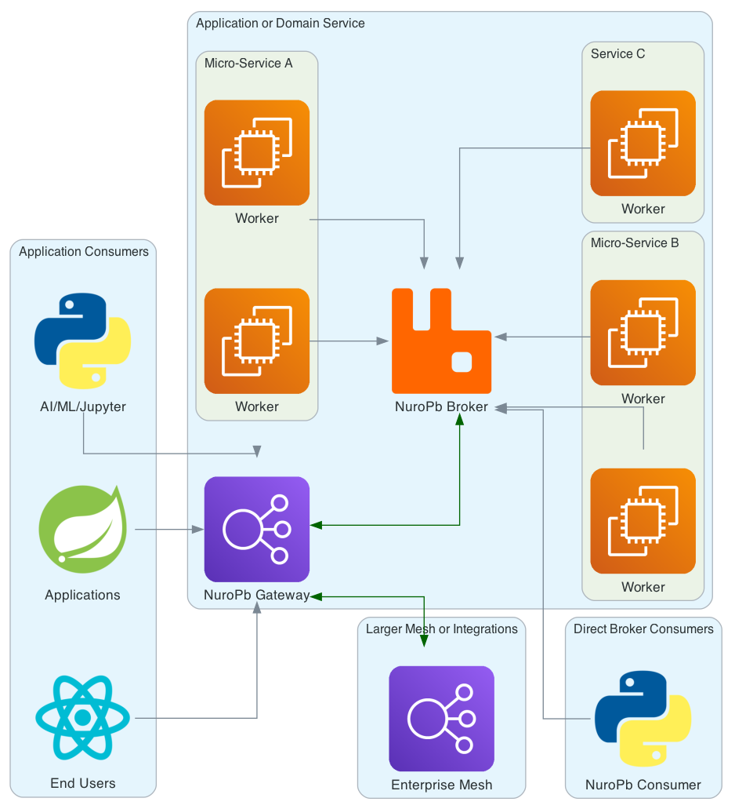

# NuroPb

## Plumbing, routing and communications for Distributed, Asynchronous, Event Driven, Services 

If you have code that you want to easily scale, communicate with other services or provide access to consumers, or:
* You'd like to scale a service horizontally, many times over at an unknown scale.
* Your service needs to communicate with other services
* Implement event driven processes and flows
* A need for websocket endpoints that integrate seamlessly to backend services and events
* A proxy for REST Consumers to interact with asynchronous services 
* A growing team of Ml-Ops and Datascience engineers who'd like to deploy their models as services
* Require service gateway that bridges cloud VPNs and on-premise networks
* Wrap an existing or legacy service to benefit from any of the above

**If any of these are of interest to you, NuroPb is worth considering.**

NuroPb is available under the [Apache License, Version 2.0](http://www.apache.org/licenses/LICENSE-2.0.html), 
this web site including all documentation is licensed under [Creative
Commons 3.0](https://creativecommons.org/licenses/by/3.0/).
